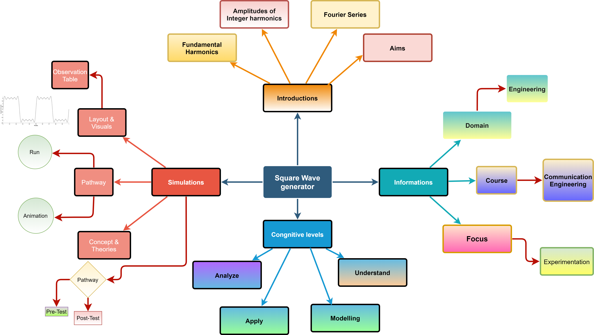

## Storyboard (Round 2)

Experiment 1: To construct a square wave with the help of fundamental frequency and its harmonic component

### 1. Story Outline:

The experiment is based on concept of Continuous Time Fourier Transform (CTFS) by introducing the generation of a periodic square wave. The impact of the fundamental harmonic on the periodicity, as well as the amplitude values of the integer harmonics can be easily visualized with this experiment. Student approaches the simulator to understand the concept of CTFS through experimental setup. The generated square wave with the help of integer harmonics will be pictured with the help of the simulator. The amplitude of the harmonics can be easily mapped in terms of peak voltages. Students enter peak values of the amplitude of the integer multiple harmonics, obtained numerically with pen and paper to see the impact of the math on the waveform generation. The objective of the experiment is to find the integrity of the CTFS towards the applications in the generation of periodic signal waveform.

### 2. Story:

CTFS has a great advantage in communication engineering. CTFS provides the best way of the representation of any periodic signal in terms of a sinusoidal waveform. The physical significance if this CTFS states that if we have a fundamental sinusoidal frequency, then anyone can generate any periodic signal with the help of the integer multiple of the fundamental harmonics. More number of harmonics leads a perfection in the shape of the periodic signal. Ideal wave shaping has been achieved with the help of infinite integer multiple of fundamental harmonics.
As the experiment is only related in the generation of the square wave, so first need to discuss the square wave. A square wave is a non-sinusoidal periodic waveform in which the amplitude alternates at a steady frequency between the fixed minimum and maximum values, with the same duration at minimum and maximum. In an ideal square wave, the transitions between minimum and maximum are instantaneous. The square wave is a special case of a pulse wave which allows arbitrary duration at minimum and maximum. The ratio of the high period to the total period of a pulse wave is called the duty cycle. A true square wave has a 50% duty cycle (equal high and low periods).
The experiment is based on the concept of Continuous-Time Fourier Transform (CTFS) by introducing the generation of a periodic square wave. The impact of the fundamental harmonic on the periodicity, as well as the amplitude values of the integer harmonics, can be easily visualized with this experiment. As stated in the previous para, anyone can generate any periodic signal with the help of CTFS. For the generation of the periodic square wave, students need to calculate the amplitude values of the integer multiple harmonics. To obtain these values students need to evaluate the expression of waveform with the trigonometric CTFS expression. Any student, who approaches the simulator to understand the concept of CTFS through the experimental setup, can visualize a real-time square waveform provided by the input panels. The real-time output can be easily observed with the help of the simulator. The amplitude of the harmonics can be easily mapped in terms of peak voltages. Students can provide the peak amplitude values of an integer multiple harmonics into the panel, obtained numerically with pen and paper to see the impact of the math on the waveform generation.

#### 2.1 Set the Visual Stage Description:
When a student visits the link of the simulator page, he will see a graph canvas (a light grey shade), on the right side of the screen. On the left side of the screen, the student observes the instruction and objective of the Experiment. All the required components will be available on the application panel.
On the bottom of the canvas, the student will observe the sliders (in blue colors), there is a total of 8 sliders, three are in two rows and two sliders are in the last row. These sliders are used to provide the amplitude of the integer multiple harmonics.  In front of the slider's current value of a slider will be displayed in black text color. For the convenience of the user, one sample of the data is already been set with the help of the slider. Using these sliders users can vary the value of input parameters, like Amplitude of the integer harmonics, Fundamental frequency etc.
Just above these sliders, the output of the application in form of a graph is visible to the user. A square wave will be generated according to the input parameters provided by the user. They can also observe the real-time output. After any change, reconstruction of the wave is also possible by providing suitable values using the slider. The amplitude values of the first harmonic (fundamental harmonic) is V1. V2 is the amplitude of the second integer multiple of the fundamental frequency and similarly, V3, V4, V5, and V6 present the amplitude of the integer multiple of the harmonics accordingly.
The user observes the change in the generated waveform in the graphical panel by adjusting the values of V1, V2, V3, V4, V5, V6 (wave is moving towards the right side with respect to positive values of time instants).
The user also sees the following things: 
•	When the user changes the values of the sliders (placed bottom part of the canvas) then automatically the current value of it also changed and the user can easily observe, how this value depends on generating the wave. 
•	If a student is prompted to set the values in each slider by sliding it, they can observe the change of values which will be visible nearly to the sliders. 
•	Firstly, a student has to set the fundamental frequency in frequency slider and note the value of it. 
•	Then students have to set the value of each harmonic amplitude in the corresponding amplitude slider and note it too. 
•	Now the student has to set the values of V1, V2, V3, V4, V5, V6 these are the main parameters in generating the "Square wave". 
•	Students must have to set the appropriate values of these parameters. 
•	This simulator work on real-time configuration, as students set the values of all parameters then automatically wave is generated or if given values are matched with the actually required parameters then the square wave will be formed. 

S. No.|	Number of harmonics |	Amplitude Values (V)
:--|:--|:--|
1. |	V1	| (1st Harmonic -Fundamental Harmonic)	
:--|:--|:--|
2.	| V2 | (2nd Harmonic)
:--|:--|:--|
3.	| V3	| (3rd Harmonic)
:--|:--|:--|
4.	| V4	| (4th Harmonic)
:--|:--|:--|
5.	| V5	| (5th Harmonic)
:--|:--|:--|
6. | V6	| (6th Harmonic)	
:--|:--|:--|
 

Note:- Students want to know the actual values of parameters and then students have to refresh the page after refreshing the wave is formed that wave is called a square wave, Through which students can check whether the answers.

#### 2.2 Set User Objectives & Goals:
The objective of the experiment is to understand and apply the concept of Continuous Time Fourier Series for the generation of a periodic signal.
1.	To understand the concept of periodicity of wave related to the trigonometric Fourier series
2.	To model a periodic square wave of the given fundamental frequency with the help of integer multiple harmonics of the fundamental frequency.
3.	To analyze the periodicity of a wave in terms of sine and cosine trigonometric functions.
4.	To explain the relationship between harmonics and periodicity
5.	To calculate the amplitude of the integer harmonics.
6.	To plot the graph
7.	Attempt the assessment questions

#### 2.3 Set the Pathway Activities:

1.	Click on the button “Start".
2.	Enter all the amplitude of the integer harmonics as per the requirement for the generation of the periodic wave. The student is required to calculate theoretical values and compare with the practical values obtained from the simulator.
3.	All components of the experimental set up are seen on the screen.
4.	This screen has the complete experimental setup to plot the periodic square wave. Observation table is on the screen.
5.	The plot of the required wave will simultaneously be available on the screen.

##### 2.4 Set Challenges and Questions/Complexity/Variations in Questions:

Formative Assessment Questions
As mentioned in Round 1:

Difficulty Level: Recall
 Q) What are Fourier coefficients?
 	a) The terms that are present in a Fourier series
 	b) The terms that are obtained through Fourier series
 	c) The terms which consist of the Fourier series along with their sine or cosine values
 	d) The terms which are of resemblance to Fourier transform in a Fourier series are called Fourier series coefficients
 Ans : (c)

 Q) What is the polar form of the Fourier series? Select most suitable answer
 	a) x(t)= c0 + ∑cn cos⁡(nwt + ϕn)
 	b) x(t)= c0 + ∑cn cos⁡(nwt + ϕn)
 	c) x(t) = ∑cn cos(nwt + ϕn)
 	d) x(t) = c0+ ∑cos(nwt + ϕn)
 Ans : (a)

Difficulty Level: Understand
 Q) Which are the Fourier coefficients in the following?
   a) a0, an and bn
   b) an
   c) bn
   d) an and bn
 Ans : (a)

Difficulty Level: Apply
 Q) Select the correct relation between the amplitude of the nth harmonic element for Fourier series (An is representing amplitude of the nth harmonic)
 	a) A7>A6> A5> A4
 	b) A7>A6< A5< A4
 	c) A7<A6< A5< A4
 	d) None of the above
 Ans : (a)

Difficulty Level: Analyze
 Q) Do exponential Fourier series also have Fourier coefficients to be evaluated.
 	a) True
 	b) False
 Ans : (a)

##### 2.5 Allow pitfalls:

The pitfall means any error or limitation occurred while doing an experiment. So, in this experiment students do not need to worry about any pitfall. The output will be generated for each provided input. The student has to observe which values or the change in values are useful for them to obtain the required result. As the application provides real-time results, so the student can directly observe the generated square wave in the graphical panel

##### 2.6 Conclusion:

Time is taken by the student to attempt the questions: --10 minutes
The student correctly answered: -----5
At the completion of this experiment, the following are the interpretations/ conclusions
There are 10 questions with different difficulty levels. Assessment/evaluation of the multiple-choice questions will be given immediately to the student. When the student clicks on the answer of his choice, the correct answer will be displayed below the question. This would enable the student to understand whether he is right or wrong. The approximate time required to understand the procedure to perform the experiment would take about 05 min. To generate data will take another 5 minutes. Calculating and entering the values in the observation table will take approximately 05 minutes. Answering the assessment questions will take about 5 min. Thus the total time required to perform the experiment will require around 20 minutes.

##### 2.7 Equations/formulas: NA

### 3. Flowchart 4
 

 

### 4. Mindmap:

  

### 5. Storyboard :
Storyboard: <a href="storyboard/storyboard.gif"> [here]</a>

