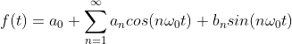
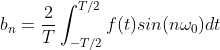
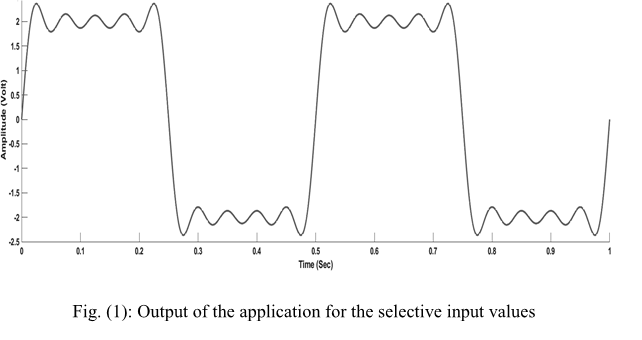

## Theory

Square wave can be made with the fundamental frequency and proper harmonics frequency value selection. Following equation is the Trigonometric representation of Continuous Time Fourier Series (CTFS) for periodic signal f(t), with a fundamental harmonic ω_0.

 

 The wave form for the generation of odd symmetric periodic square wave with an zero average over a single time interval is given by
 

  
 

 Above expression is clearly revealing that, the plot of a periodic perfect square wave requires infinite number of harmonics. These harmonics are the integer multiple of fundamental harmonics ω_0 (ω_0=2π/T, where T is the fundamental time period of the wave). The term a_0,a_n,b_n can be expressed as
 

  
  
  
 

 The values of the integer multiple of the harmonic amplitude can be calculated with the help of above equations
 

  
